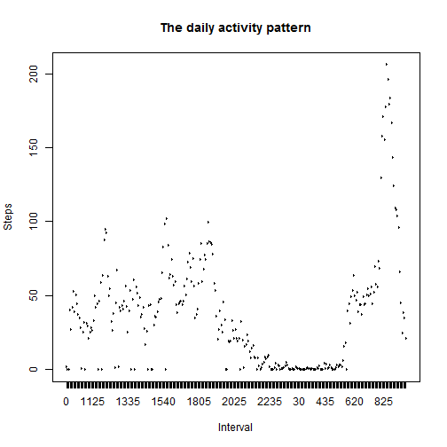

# Reproducible Research: Peer Assessment 1


## Loading and preprocessing the data

```r
setwd("D:/Dropbox/MOOC/2014_Reprocudible Research/Peer Assessment/week 2/RepData_PeerAssessment1/")
data <- read.csv("./activity/activity.csv")
prepData <- data[!is.na(data$steps), ]
```


## What is mean total number of steps taken per day?

```r
dailyStepData <- lapply(split(prepData$steps, prepData$date), sum, na.rm = TRUE)
dailyStepData <- data.frame(date = names(dailyStepData), steps = unlist(dailyStepData))
plot(strptime(dailyStepData$date, format = "%Y-%m-%d"), as.numeric(dailyStepData$steps), 
    main = "The total number of steps taken each day", type = "h", xlab = "Date", 
    ylab = "Total number of steps")
```

 

```r
mean(dailyStepData$steps, na.rm = TRUE)
```

```
## [1] 9354
```

```r
median(dailyStepData$steps, na.rm = TRUE)
```

```
## [1] 10395
```


## What is the average daily activity pattern?

```r
avgStepData <- lapply(split(prepData$steps, prepData$interval), mean)
avgStepData <- data.frame(interval = names(avgStepData), steps = unlist(avgStepData))

plot(avgStepData$interval, avgStepData$steps, main = "The daily activity pattern", 
    type = "l", xlab = "Interval", ylab = "Steps")
```

 


## Imputing missing values

```r
sum(!complete.cases(data))
```

```
## [1] 2304
```

```r

library(plyr)
impute.mean <- function(x) replace(x, is.na(x), mean(x, na.rm = TRUE))
newData <- sapply(data, function(x) {
    if (is.numeric(x)) {
        impute.mean(x)
    } else {
        x
    }
})

newData <- data.frame(newData)

dailyStepData <- lapply(split(newData$steps, newData$date), sum, na.rm = TRUE)
dailyStepData <- data.frame(date = names(dailyStepData), steps = unlist(dailyStepData))
plot(strptime(dailyStepData$date, format = "%Y-%m-%d"), as.numeric(dailyStepData$steps), 
    main = "The total number of steps taken each day", type = "h", xlab = "Date", 
    ylab = "Total number of steps")
```

```
## Warning: no non-missing arguments to min; returning Inf
## Warning: no non-missing arguments to max; returning -Inf
```

```
## Error: need finite 'xlim' values
```

 

```r
mean(dailyStepData$steps, na.rm = TRUE)
```

```
## [1] 10766
```

```r
median(dailyStepData$steps, na.rm = TRUE)
```

```
## [1] 10766
```


## Are there differences in activity patterns between weekdays and weekends?
